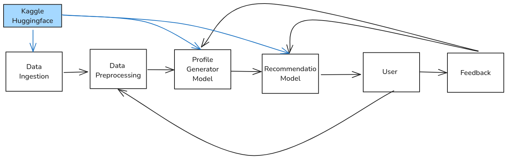

## Assignment Structure
Students will work in groups of 3 to 4. There are 6 assignments in total, each taking 2 weeks. Each group will have a single Github repository with the TA added as a developer. All assignments will be submitted to the same repository.
## Token System
- Each group receives 5 tokens.
- 3 tokens may be spent to redo an assignment at any time. 
- 1 token may be spent to submit an assignment late by 1 day (2 for 2 days).
## Assignments and Project
- The assignments will have a theory section and a coding section. The coding will contribute to a semester-long project, which will have presentation at the middle and end of the semester. 
- The theory section for each assignment will be graded. The code will only be graded at the end of the semester (combined with the presentations).
- The code will be evaluated with the theory submission every two weeks to give students feedback, but will not be graded then.
- Project topic:
	- The project will be about designing a movie recommendation system. There should be a single pipeline with two models.
	- 
## Assignment submission
- All assignments are submitted by pushing the code to a repository on Github. 
- Pushes made after the deadline will not be considered during grading unless tokens are used.
## Assignment grading
- Each assignment will be worth 100 points, for a total of 600 points. 
- The project code will be worth 600 points.
- A total of 600 points must be earned to be eligable for the exam. 
## Assignment content
1. Intro and pipeline
	1. A client wants a system that can recommend movies to a user. Students will develop a basic ML system using public data and a public model (https://huggingface.co and https://www.kaggle.com/). The pipeline should have mainly the same components as the image above. There will be few details, and this will serve as a basic proof-of-concept.
	2. Theory: the students explain their pipeline (choice of components) and their choice of model and data, as well as their data pre-processing.
	3. Code: the students implement the pipeline into a functional proof-of-concept.  
